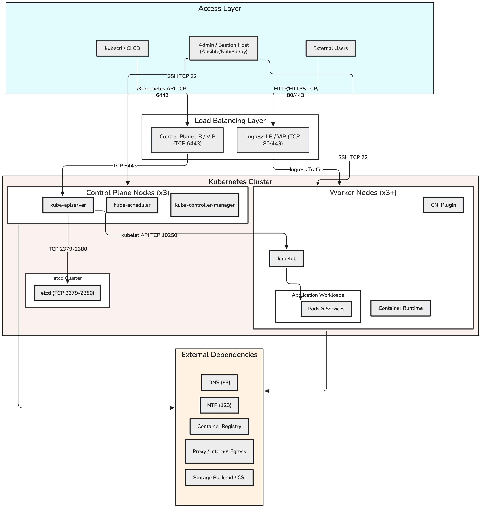

# Kubernetes Deployment with Kubespray

## Table of Contents

*   [Purpose](#purpose)
*   [What Is Kubespray?](#what-is-kubespray)
*   [Architecture Overview](#architecture-overview)
*   [When to Use Kubespray](#when-to-use-kubespray)
*   [Version Compatibility and Pinning](#version-compatibility-and-pinning)
*   [Repository Layout](#repository-layout)
*   [High-Level Flow](#high-level-flow)
*   [Prerequisites](#prerequisites)
*   [Node Sizing and Requirements](#node-sizing-and-requirements)
*   [Control Plane Endpoint (HA)](#control-plane-endpoint-ha)
*   [Inventory and Configuration](#inventory-and-configuration)
*   [Network Plugins (CNI)](#network-plugins-cni)
*   [Air-gapped and Restricted Environments](#air-gapped-and-restricted-environments)
*   [Deploying the Cluster](#deploying-the-cluster)
*   [Post-Deployment Validation](#post-deployment-validation)
*   [Post-Deployment Components](#post-deployment-components)
*   [Scaling the Cluster](#scaling-the-cluster)
*   [Node Replacement](#node-replacement)
*   [Node Provisioning & OS Baseline](#node-provisioning--os-baseline)
*   [Upgrading the Cluster](#upgrading-the-cluster)
*   [Backup and Restore](#backup-and-restore)
*   [Maintenance: Draining and Patching](#maintenance-draining-and-patching)
*   [Security Hardening Checklist](#security-hardening-checklist)
*   [Resetting the Cluster](#resetting-the-cluster)
*   [Common Issues](#common-issues)
*   [Best Practices](#best-practices)
*   [Definition of Done](#definition-of-done)
*   [Summary](#summary)

---

## Purpose

This document describes how to deploy and manage a self-managed Kubernetes cluster using **Kubespray** and **Ansible**. It provides a practical engineering runbook for provisioning clusters in environments where managed services are not available or where fine-grained control over the control plane is required.

> [!NOTE]
> This document is not a replacement for the official Kubespray documentation. It is a practical engineering runbook for understanding the deployment flow, required inputs, validation steps, and operational risks.

---

## What Is Kubespray?

Kubespray is an Ansible-based project used to deploy and manage production-ready Kubernetes clusters. It leverages `kubeadm` under the hood but automates the heavy lifting of environment preparation and component configuration.

Kubespray automates:
*   Operating system preparation (packages, sysctl, kernel modules)
*   Container runtime installation (containerd, Docker)
*   Kubernetes control plane setup
*   Worker node provisioning
*   Highly available etcd cluster setup
*   CNI installation (Calico, Cilium, Flannel, etc.)
*   Kubelet and kubeadm configuration

> [!IMPORTANT]
Kubespray creates a self-managed Kubernetes cluster. The team is responsible for upgrades, monitoring, backups, security, and operational support of both the workloads and the control plane itself.

---

## Architecture Overview

The following diagram provides a high-level overview of the Kubernetes architecture deployed and configured using Kubespray.



---

## When to Use Kubespray

### Recommended Use Cases
*   **On-prem / Bare Metal:** When running Kubernetes directly on physical hardware.
*   **Private Cloud:** Deploying on OpenStack, vSphere, or other private virtualization layers.
*   **Restricted Environments:** Air-gapped or highly regulated environments where external access is limited.
*   **Deep Customization:** When specific CNI, storage, or runtime configurations are required.

### When Not to Use Kubespray
*   **Public Cloud (EKS/AKS/GKE):** Managed services are generally preferred to reduce operational overhead.
*   **No Dedicated Ops Team:** If the team cannot commit to regular control plane maintenance.

---

## Version Compatibility and Pinning

Production deployments should always use a tested and pinned Kubespray release tag. Avoid deploying production clusters directly from the `master` branch.

### 1. Pinning the Version
Always check out a specific release tag before starting:

```bash
# Example: Pinning to v2.31.0
git checkout v2.31.0
```

### 2. Compatibility Check
Before deployment, verify the compatibility matrix in the Kubespray documentation between:
*   Kubespray version
*   Kubernetes version
*   Ansible version
*   Python version
*   Target OS version
*   Container runtime version
*   CNI plugin version

---

## Repository Layout

It is important to distinguish between your custom inventory repository and the upstream Kubespray repository.

### Example Structure
```text
cloud/
  ansible/
    docs/
      kubespray-kubernetes-deployment.md
    inventories/
      lab/
        inventory.ini
        group_vars/
          all/
          k8s_cluster/
```

### Running the Playbook
Run the playbook from the **upstream Kubespray directory**, pointing to your inventory in this repository:

```bash
cd kubespray
ansible-playbook -i ../cloud/ansible/inventories/lab/inventory.ini cluster.yml -b -v
```

---

## High-Level Flow

```text
Prepare Nodes -> Configure SSH -> Create Inventory -> Configure Cluster -> Run Kubespray -> Validate Cluster
```

---

## Prerequisites

*   **Git:** To clone Kubespray.
*   **Python 3.x:** Required for Ansible.
*   **venv:** Python virtual environment for dependencies.
*   **SSH Access:** Public key authentication and sudo privileges on target nodes.

```bash
# Initial Setup
python3 -m venv .venv
source .venv/bin/activate
pip install -r requirements.txt
```

---

## Node Sizing and Requirements

The following recommendations are baseline starting points. Values should be adjusted based on real-world application load.

| Environment | Node Role | Node Count | CPU per Node | RAM per Node | Disk per Node | Notes |
| :--- | :--- | ---------: | -----------: | -----------: | ------------------: | :--- |
| **Test/Lab** | Combined control-plane + worker | 1-3 | 2-4 vCPU | 4-8 GB | 40-80 GB | Suitable for learning and validating configs |
| **Test/Lab** | Worker | 1-2 | 2-4 vCPU | 4-8 GB | 40-80 GB | Optional, useful for testing scheduling |
| **Production** | Control Plane | 3 | 4 vCPU | 8-16 GB | 80-120 GB | Required for HA control plane |
| **Production** | Worker | 3+ | 4-8 vCPU | 16-32 GB | 100+ GB | Scale based on application workloads |
| **Production** | Dedicated etcd | 3 | 2-4 vCPU | 8-16 GB | 80-120 GB fast disk | Recommended for larger or strict HA setups |

### Sizing Notes
*   **Small Clusters:** Control-plane nodes can also run etcd.
*   **Critical Environments:** Use dedicated etcd nodes with high-performance disks to isolate I/O.
*   **Workload Impact:** Monitoring (Prometheus), logging (Loki), ingress controllers, and service meshes significantly increase resource requirements.
*   **Validation:** Always perform capacity/load testing before production go-live.

---

## Control Plane Endpoint (HA)

A production HA cluster requires a stable control plane endpoint in front of the Kubernetes API servers (port `6443`). This endpoint is used by kubelets and kubectl clients.

Common implementation methods:
*   **External TCP Load Balancer:** Cloud LB or F5.
*   **HAProxy + Keepalived:** Standard for bare-metal/VM setups.
*   **kube-vip:** Provides a virtual IP for the control plane.

---

## Inventory and Configuration

Kubespray configuration is managed via an `inventory.ini` and `group_vars`.

### Key Configuration Files
*   `inventory/<cluster-name>/inventory.ini`: Defines host groups (kube_control_plane, kube_node, etcd).
*   `inventory/<cluster-name>/group_vars/all/all.yml`: Global settings like proxy and cloud providers.
*   `inventory/<cluster-name>/group_vars/k8s_cluster/k8s-cluster.yml`: Kubernetes specific settings (version, CNI, runtime).

---

## Network Plugins (CNI)

Choose a CNI based on your networking and security requirements.

| CNI | Use Case |
| :--- | :--- |
| **Calico** | Common default, strong support for NetworkPolicy. |
| **Cilium** | Advanced networking, eBPF-based, high performance, and observability. |
| **Flannel** | Simple networking, suitable for basic lab environments. |

---

## Air-gapped and Restricted Environments

In restricted enterprise environments, target nodes must have access to required packages and images.

**Checklist:**
*   [ ] Proxy configuration (if egress is via proxy).
*   [ ] Private container registry (mirrored images).
*   [ ] Internal OS package repositories (apt/yum mirrors).
*   [ ] Firewall rules permitting node-to-node and node-to-LB traffic.
*   [ ] Time synchronization (NTP/Chrony) with internal sources.

---

## Deploying the Cluster

Ensure SSH connectivity first:
```bash
ansible -i inventory/lab/inventory.ini all -m ping -b
```

Run the deployment:
```bash
ansible-playbook -i inventory/lab/inventory.ini cluster.yml -b -v
```

---

## Post-Deployment Validation

### Health Checklist
*   [ ] All nodes are in `Ready` state.
*   [ ] All system pods are `Running` or `Completed`.
*   [ ] CoreDNS is healthy.
*   [ ] CNI pods are healthy.

### Validation Commands
```bash
kubectl get nodes -o wide
kubectl get pods -A
kubectl cluster-info
kubectl top nodes
kubectl run dns-test --image=busybox:1.36 --rm -it --restart=Never -- nslookup kubernetes.default
```

---

## Post-Deployment Components

Kubespray provides the foundation. A production platform usually requires:

| Area | Example Components |
| :--- | :--- |
| **Ingress** | NGINX Ingress, HAProxy Ingress, Traefik |
| **LoadBalancer** | MetalLB (for bare metal), kube-vip |
| **Storage** | Longhorn, Rook/Ceph, CSI Drivers |
| **Monitoring** | Prometheus, Grafana |
| **Backup** | Velero |
| **Certificates** | cert-manager |

---

## Scaling the Cluster

To add a new node:
1.  Provision the node and add it to `inventory.ini`.
2.  Run the scale playbook:
```bash
ansible-playbook -i inventory/lab/inventory.ini scale.yml -b -v
```

---

## Node Replacement

1.  **Drain:** `kubectl drain <node> --ignore-daemonsets --delete-emptydir-data`
2.  **Delete:** `kubectl delete node <node>`
3.  **Cleanup:** `ansible-playbook -i inventory/lab/inventory.ini remove-node.yml -b -v -e "node=<node>"`
4.  **Add:** Follow the [Scaling](#scaling-the-cluster) process.

---

## Node Provisioning & OS Baseline

Before Kubespray, nodes should be prepared via an Ansible baseline playbook ensuring:
*   Authorized SSH keys.
*   Passwordless sudo.
*   Python 3 installed.
*   Kernel modules (br_netfilter, overlay) loaded.
*   Required sysctl settings (`net.bridge.bridge-nf-call-iptables = 1`).

---

## Upgrading the Cluster

Upgrades must be incremental (e.g., 1.25.x -> 1.26.x).

```bash
# Update kube_version in group_vars first
ansible-playbook -i inventory/lab/inventory.ini upgrade-cluster.yml -b -v
```

> [!WARNING]
> Do not upgrade production clusters without a verified backup and a tested rollback strategy.

---

## Backup and Restore

### etcd Snapshots
A backup is not valid until a restore has been tested.

```bash
# Automated Snapshot via Kubespray
ansible-playbook -i inventory/lab/inventory.ini extra_playbooks/upgrade-cluster.yml --tags=etcd_snapshot

# Manual Snapshot (Example)
ETCDCTL_API=3 etcdctl snapshot save /tmp/snapshot.db \
  --endpoints=https://127.0.0.1:2379 \
  --cacert=/etc/kubernetes/ssl/etcd/ca.pem \
  --cert=/etc/kubernetes/ssl/etcd/admin.pem \
  --key=/etc/kubernetes/ssl/etcd/admin-key.pem
```

---

## Security Hardening Checklist

*   [ ] RBAC review (Least Privilege).
*   [ ] Pod Security Admission (PSA) enabled.
*   [ ] NetworkPolicies implemented between namespaces.
*   [ ] Encryption at rest for Secrets.
*   [ ] API Server access restricted by IP/VPN.
*   [ ] CIS Benchmark validation (e.g., via `kube-bench`).

---

## Resetting the Cluster

> [!WARNING]
> This command is destructive and removes all Kubernetes data.
```bash
ansible-playbook -i inventory/lab/inventory.ini reset.yml -b -v
```

---

## Common Issues

| Problem | Possible Cause | Suggested Check |
| :--- | :--- | :--- |
| **Node NotReady** | CNI issue or Kubelet failure | Check `journalctl -u kubelet` and CNI pod logs |
| **Pods Pending** | No resources or missing storage | Check `kubectl describe pod` and events |
| **DNS Failure** | CoreDNS or CNI config issue | Check CoreDNS logs and service IPs |
| **Image Pull Error** | Registry access or missing image | Check registry connectivity and image names |
| **API Unavailable** | LB issue or control plane failure | Check port 6443 and control plane health |

---

## Best Practices

*   **Pin Releases:** Never use `master` for production.
*   **Test in Lab:** Always validate changes in a non-prod environment.
*   **GitOps:** Store inventories and configurations in Git.
*   **Monitor Expiry:** Track certificate expiration dates.
*   **Immutable Nodes:** Avoid manual configuration changes on nodes.

---

## Definition of Done

A Kubespray deployment is complete when:
*   [ ] All nodes are `Ready`.
*   [ ] System pods are `Running`.
*   [ ] API is reachable through the HA endpoint.
*   [ ] Internal DNS resolution is verified.
*   [ ] CNI networking is functional.
*   [ ] etcd backup is configured and tested.
*   [ ] Monitoring/Logging requirements are documented.
*   [ ] Inventory is committed to Git.

---

## Summary

Kubespray provides a flexible foundation for self-managed Kubernetes. Success depends on version pinning, proper HA planning, and a consistent operational strategy for upgrades and backups.
