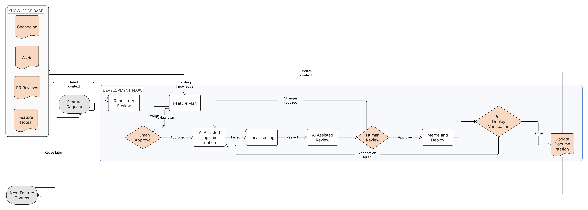

# Legacy Application Development Workflow

## 1. Introduction

Legacy and internal applications are difficult because the code often reflects years of production fixes, changing business rules, staff turnover, and undocumented operational knowledge. The system may work, but the reasons behind its structure are not always visible in the repository.

Engineers inheriting these systems usually face the same problems:
- unclear ownership boundaries
- outdated dependencies or deprecated integrations
- hidden coupling between services, jobs, scripts, and dashboards
- production behavior that is only known by a few people
- missing context for previous design decisions
- repeated repository analysis every time a new feature starts

This workflow is for maintaining and refactoring existing applications without losing project knowledge between development iterations. It assumes engineers may work on Feature A today, Feature B next month, and a future migration later, while needing the previous context to remain understandable to humans and easy for LLM tools to consume.

The goal is not to create process for its own sake. The goal is to make changes safer, make future work faster, and help the next engineer understand why the system changed.

Common examples include:
- replacing deprecated integrations
- migrating between vendor APIs
- refactoring internal tools
- extending operational platforms
- removing obsolete background jobs
- improving reliability around existing workflows

## 2. Repository Discovery

Before changing code, understand how the existing system works today. In legacy systems, the first implementation idea is often wrong because the real behavior lives across multiple files, services, or operational scripts.

### Understanding Architecture

Start by identifying the application shape:
- entry points such as web servers, workers, jobs, and CLIs
- framework conventions and routing
- database access patterns
- configuration and environment variables
- deployment model and runtime assumptions
- ownership boundaries between modules or services

For example, an internal operations platform may have a web UI, an API service, scheduled jobs, and Terraform-managed infrastructure. A feature that appears to touch only the UI may actually depend on worker behavior or cloud permissions.

### Identifying Key Components

Map the components that matter for the requested change:
- user-facing screens or API endpoints
- domain modules and service classes
- persistence layer and schema objects
- background workers and scheduled tasks
- authentication and authorization checks
- logging, metrics, and alerting paths

Do not document every file. Document the files that explain how the behavior flows.

### Finding Integration Points

Legacy systems often depend on external systems that are easy to miss:
- third-party APIs
- internal service APIs
- message queues
- webhooks
- file imports and exports
- identity providers
- cloud services
- monitoring or ticketing integrations

When replacing a deprecated integration or migrating between APIs, list both the old and new integration points. Include credentials, rate limits, payload differences, retry behavior, and rollback options where relevant.

### Mapping Dependencies

Record the dependencies that affect change risk:
- runtime dependencies and package managers
- database migrations and schema ownership
- deployment pipeline dependencies
- feature flags and configuration
- shared libraries
- infrastructure modules
- downstream consumers

Dependency mapping helps avoid accidental breakage. It also gives future engineers and LLM tools enough context to answer, "What else could this affect?"

## 3. Feature Development Workflow

Use the same workflow for Feature A, Feature B, and future feature work. The steps are deliberately repetitive because repetition preserves context and reduces surprise.

### Feature Request

Capture the problem before implementation details.

Inputs may include:
- Jira ticket
- product request
- internal requirement
- bug report
- customer request
- operational pain point

Output:
- feature description
- acceptance criteria
- known constraints
- production risk notes

Example: "Replace the deprecated billing export API before the vendor shutdown date" is better than "Update the export code."

### Repository Review

Review the existing system before writing code.

Output:
- repository summary for the feature area
- impacted files and services
- existing related implementations
- dependencies and integration points
- high-risk areas

For a refactor of an internal tool, this step should identify whether the current behavior is relied on by scripts, dashboards, or scheduled jobs.

### Feature Planning

Create a short implementation plan before generating code.

The plan should answer:
- what files will change
- why those files need to change
- what alternatives exist
- what can break
- what tests are needed
- how the change can be rolled back

Output:
- implementation plan
- testing strategy
- rollback strategy

No code should be written before this plan is reviewed for non-trivial changes.

### Human Approval

An engineer reviews the plan before implementation.

Check:
- the approach fits the existing architecture
- the scope is reasonable
- the change is not over-engineered
- operational risk is understood
- rollback is possible

Output:
- approved plan
- revised plan
- rejected plan

### Implementation

Implement the approved plan with the smallest practical change.

Rules:
- modify only required files
- avoid unrelated refactoring
- reuse existing patterns
- keep compatibility where needed
- explain why each changed file was touched

For example, when migrating from one internal API to another, keep the public behavior stable unless the feature explicitly changes it.

### Local Testing

Verify the change before opening a pull request.

Checks:
- feature works as expected
- existing tests pass
- relevant integration paths are tested
- logs are understandable
- no obvious regressions appear
- failure behavior is acceptable

Output:
- test commands run
- results
- known gaps

### AI-Assisted PR Review

Use a separate AI-assisted review pass after implementation.

Ask the reviewer to check:
- correctness
- maintainability
- duplicated logic
- security risk
- production risk
- rollback concerns
- missing tests
- drift from the approved plan

Output:
- review findings
- improvement recommendations
- accepted or rejected recommendations

This is a second opinion, not a replacement for engineering judgment.

### Human Review

A human engineer performs the final review.

Questions:
- Do I understand the implementation?
- Can I explain the rollback?
- Are tests sufficient for the risk?
- Does this preserve the architecture?
- Can another engineer support this in production?

If the reviewer cannot explain the change, the pull request is not ready.

### Merge & Deploy

Deploy through the normal delivery pipeline.

Checks:
- deployment succeeded
- application health checks pass
- monitoring shows no regressions
- key workflows still work
- rollback procedure is known

Output:
- production deployment
- post-deploy verification notes

### Documentation Updates

Update project knowledge as part of the change.

Update:
- ADRs for architectural decisions
- feature notes for behavior changes
- PR review notes for important review findings
- changelog for user-visible or operational changes
- operational notes for runbooks, alerts, or support procedures

Documentation should record decisions and context, not duplicate code.

### Next Feature Context

Before starting the next feature, collect the relevant context package:
- ADRs
- feature notes
- changelog entries
- previous PR review notes
- operational notes

This prevents Feature B from rediscovering the same facts already learned during Feature A.

## 4. Knowledge Base Strategy

A lightweight knowledge base keeps project context available across weeks or months of maintenance work.

### ADRs

Architecture Decision Records explain decisions that affect system structure.

Use ADRs for:
- replacing one integration pattern with another
- changing database ownership
- adopting or removing a service boundary
- changing authentication or authorization design
- introducing a migration strategy

ADRs should include:
- decision
- context
- alternatives considered
- consequences
- rollback or replacement notes

### Feature Notes

Feature notes explain what changed and why.

Use feature notes for:
- Feature A implementation details
- Feature B follow-up behavior
- API migration steps
- internal workflow changes
- compatibility decisions

Feature notes should help a future engineer understand the work without reading every commit.

### PR Review Notes

PR review notes preserve important feedback that may not belong in code comments.

Capture:
- production concerns raised during review
- security or data handling questions
- test gaps that were accepted intentionally
- follow-up tasks
- rejected alternatives

These notes are useful when similar work appears later.

### Changelog

The changelog records meaningful changes over time.

Include:
- user-visible changes
- operational changes
- integration changes
- migrations
- deprecations
- rollback-relevant notes

Keep entries short and dated.

### Operational Notes

Operational notes explain how the system behaves in production.

Include:
- runbook updates
- alerts and dashboards
- known failure modes
- manual recovery steps
- deployment caveats
- dependency shutdown dates

For legacy systems, operational notes are often as important as code comments.

## 5. Recommended Repository Structure

Keep documentation close to the repository and easy for humans and LLM tools to scan.

Example:

```text
docs/
|-- adr/
|-- features/
|-- pr-reviews/
|-- changelog.md
`-- legacy-application-development.md
```

Recommended contents:
- `docs/adr/`: architecture decisions
- `docs/features/`: feature notes grouped by feature or date
- `docs/pr-reviews/`: durable review notes and risk findings
- `docs/changelog.md`: chronological change history
- `docs/legacy-application-development.md`: this workflow

Use short Markdown files. Avoid large duplicated documents that become stale.

## 6. Context Preservation

Future feature work should begin by reading existing project context before analyzing the repository from scratch.

Consume these sources first:
- ADRs: understand architectural decisions and constraints
- feature notes: understand previous behavior changes
- changelog: understand the sequence of changes
- previous PR reviews: understand risks, tradeoffs, and rejected approaches
- operational notes: understand production behavior and support procedures

For example, before Feature B extends a reporting workflow, review the notes from Feature A if Feature A changed the export API, database query model, or permissions. That context may explain why the code uses a compatibility layer or why a simpler-looking refactor was avoided.

This approach helps LLM tools consume the repository efficiently. Instead of asking the tool to rediscover months of history, provide a concise context package:

```text
Read these files first:
- docs/adr/...
- docs/features/feature-a.md
- docs/pr-reviews/feature-a-review.md
- docs/changelog.md

Then review the code related to Feature B and propose a plan.
```

The result is faster repository analysis, fewer repeated questions, and better continuity between development sessions.

## 7. Human Ownership

AI tools can help read code, summarize context, draft plans, generate tests, and review pull requests. Engineers remain responsible for the work.

Engineers own:
- architecture decisions
- code quality
- testing scope
- production impact
- security and data handling
- rollback plans
- final approval
- operational support

If the engineer cannot explain the implementation, risk, and rollback path, the change is not ready.

## 8. Workflow Diagram

The Eraser workflow diagram below shows the full loop from feature request through implementation, review, deployment, documentation, and future context reuse.



Step summary:
- Feature Request: define the problem, constraints, and acceptance criteria.
- Repository Review: inspect the current system before choosing an approach.
- Feature Plan: describe the implementation, tests, alternatives, and rollback.
- Human Approval: confirm the plan fits the architecture and risk tolerance.
- AI Implementation: generate or edit code within the approved scope.
- Local Testing: verify behavior and catch regressions before review.
- AI PR Review: get a second pass on correctness, maintainability, and production risk.
- Human Review: ensure an engineer understands and can support the change.
- Merge & Deploy: release through the normal delivery pipeline and verify health.
- Update Docs: preserve decisions, feature notes, review findings, and changelog entries.
- Next Feature Context: feed the preserved context into the next feature cycle.

The knowledge base closes the loop. ADRs, feature notes, PR review notes, and the changelog become inputs for the next feature instead of being lost in commit history or chat transcripts.
