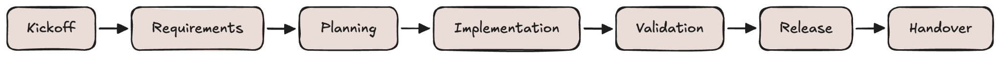

# Engineering Project Kickoff and Delivery Playbook

## Table of Contents

* [Purpose](#purpose)
* [Core Idea](#core-idea)
* [Teams Involved](#teams-involved)
* [Project Kickoff](#project-kickoff)
* [Requirements](#requirements)
* [Planning](#planning)
* [Scrum Delivery](#scrum-delivery)
* [Weekly Tracking](#weekly-tracking)
* [Decision Log](#decision-log)
* [Risks and Blockers](#risks-and-blockers)
* [Validation](#validation)
* [Definition of Done](#definition-of-done)
* [Project Flow](#project-flow)

---

## Purpose

This document describes how a senior engineer can lead the kickoff, alignment, planning, delivery, and tracking of an engineering project.

It can be used for:

* greenfield cloud projects
* cloud migrations
* Kubernetes projects
* CI/CD implementation
* platform engineering work
* infrastructure automation
* application onboarding
* observability or security improvements

> [!NOTE]
> The goal is not to create bureaucracy.
> The goal is to make the project clear, visible, trackable, and safe to deliver.

---

## Core Idea

Before implementation starts, the team should understand:

* what is being built or changed
* why it is needed
* who owns each part
* what is in scope
* what is out of scope
* what the requirements are
* how progress will be tracked
* how success will be validated

> [!IMPORTANT]
> A senior engineer should not only implement the technical solution.
> A senior engineer should create clarity before implementation starts.

---

## Teams Involved

Not every project needs every team.

The senior engineer should identify which teams are required and what each team owns.

| Team               | Responsibility                                                           |
| ------------------ | ------------------------------------------------------------------------ |
| Product / Business | Goal, priority, deadline, expected outcome                               |
| Developers         | Application behavior, code changes, configuration, functional validation |
| Platform / DevOps  | Infrastructure, cloud, Kubernetes, CI/CD, automation                     |
| SRE / Operations   | Reliability, monitoring, alerting, runbooks, support readiness           |
| QA                 | Test strategy, smoke tests, regression testing, validation               |
| Security           | RBAC, secrets, compliance, network exposure, approval                    |
| Networking         | DNS, ingress, certificates, routing, firewall rules                      |
| DBA / Data Team    | Databases, backups, restore, data migration, data integrity              |

> [!WARNING]
> Do not assume ownership.
> If ownership is unclear, the project will slow down or fail during delivery, validation, or support.

---

## Project Kickoff

The first step is a kickoff discussion.

The goal is to create a shared understanding before implementation starts.

### Kickoff Questions

* What problem are we solving?
* Why are we doing this now?
* Who requested this?
* Who will use the solution?
* Who will maintain it later?
* What is in scope?
* What is out of scope?
* What are the known risks?
* What are the dependencies?
* How do we know this is done?

### Kickoff Output

After kickoff, the team should have:

* project goal
* list of stakeholders
* initial scope
* known risks
* known dependencies
* tracking board
* communication channel
* next steps

> [!NOTE]
> The kickoff does not need to solve every technical detail.
> It should create enough clarity to start discovery and planning.

---

## Requirements

Requirements should be clear, testable, and owned.

### Bad Requirement

```text
The platform should be secure.
```

### Better Requirement

```text
The platform must use RBAC, store secrets outside of Git, restrict production access, and provide audit logs for administrative actions.
```

### Requirement Template

```markdown
## Requirement: <name>

### Description

What is needed and why.

### Owner

Team or person responsible.

### Priority

Must have / Should have / Nice to have

### Acceptance Criteria

- Condition 1
- Condition 2
- Condition 3

### Dependencies

- Dependency 1
- Dependency 2

### Notes

Open questions or additional context.
```

> [!IMPORTANT]
> A requirement is not ready if it has no owner or no acceptance criteria.

---

## Planning

After requirements are collected, the work should be split into phases.

Example phases:

1. Discovery
2. Design
3. Implementation
4. Validation
5. Release or migration
6. Handover
7. Cleanup

Each phase should have:

* owner
* expected output
* related tickets
* dependencies
* acceptance criteria

### Example Phase

```markdown
## Phase: Design

### Goal

Create and review the target technical design.

### Owner

Senior Engineer / Tech Lead

### Output

- architecture document
- open questions
- risk list
- implementation plan

### Done When

- design is reviewed
- major risks are known
- required teams agree with the approach
```

> [!WARNING]
> Do not start implementation only from verbal agreement.
> At minimum, scope, owners, risks, and acceptance criteria should be written down.

---

## Scrum Delivery

Scrum can be used to keep delivery structured and visible.

The goal is not to create unnecessary meetings.
The goal is to make progress, blockers, and ownership clear.

### Backlog Refinement

Used to clarify upcoming work.

Each task should answer:

* what needs to be done
* why it is needed
* who owns it
* what the acceptance criteria are
* whether there are dependencies
* whether the task is small enough

### Sprint Planning

Used to decide what will be delivered next.

Sprint planning should confirm:

* sprint goal
* selected tasks
* task owners
* priorities
* dependencies
* blockers
* validation work

### Standup or Async Update

Each person should answer:

```text
What did I finish?
What am I working on?
Am I blocked?
Do I need help from another team?
```

> [!NOTE]
> For experienced teams, async updates can replace daily standups if progress and blockers are visible.

### Sprint Review

Used to show completed work and collect feedback.

Focus on working output, not activity.

### Retrospective

Used to improve the process.

Focus on:

* what slowed the team down
* what was unclear
* what should change next time
* which risks were missed

---

## Weekly Tracking

For multi-team projects, the senior engineer should send a short weekly status update.

### Weekly Status Template

```markdown
# Weekly Project Status

## Overall Status

Green / Yellow / Red

## Completed

- Item 1
- Item 2

## In Progress

- Item 1
- Item 2

## Blocked

- Blocker 1
- Blocker 2

## Risks

- Risk 1
- Risk 2

## Decisions Needed

- Decision 1
- Decision 2

## Next Steps

- Step 1
- Step 2
```

### Status Meaning

| Status | Meaning                                                      |
| ------ | ------------------------------------------------------------ |
| Green  | Project is on track                                          |
| Yellow | There are risks or blockers, but delivery is still realistic |
| Red    | Delivery is blocked or timeline/scope is at serious risk     |

> [!IMPORTANT]
> Weekly tracking should be factual.
> Avoid long status updates that hide the real problem.

---

## Decision Log (ADR)

Important decisions should be written down as Architecture Decision Records (ADRs).

Examples:

* cloud provider choice
* deployment strategy
* migration approach
* rollback strategy
* security model
* networking approach
* CI/CD design
* database migration approach

### Decision Template

```markdown
# Decision: <short title>

## Context

Why this decision was needed.

## Options

1. Option A
2. Option B
3. Option C

## Decision

What was decided.

## Reason

Why this option was selected.

## Impact

What this changes.

## Owner

Who owns this decision.
```

> [!WARNING]
> Important decisions should not live only in Slack, Teams, or private conversations.

---

## Risks and Blockers

A risk is something that might become a problem.

A blocker is something that is already stopping progress.

### Risk and Blocker Template


| Item | Type | Impact | Owner | Mitigation / Next Step | Status |
|---|---|---|---|---|---|
| Missing production access | Blocker | High | Platform | Request access from cloud team | Open |
| Unknown database dependency | Risk | High | Developers | Confirm with application owner | Open |
| Missing rollback plan | Risk | High | Senior Engineer | Define before production release | Open |


Common risks:

* unclear ownership
* missing requirement
* missing access
* hidden dependency
* unclear production process
* missing monitoring
* missing rollback
* incomplete testing
* missing security approval
* scope creep

> [!IMPORTANT]
> Risks should be visible before they become incidents.

---

## Validation

Implementation alone does not mean the project is done.

A project is done when it is implemented, validated, documented, and owned.

### Technical Validation

* infrastructure is created
* deployment works
* required services are reachable
* authentication works
* authorization works
* secrets are handled correctly
* logs are available
* metrics are available
* alerts are configured

### Functional Validation

* main user flow works
* application team confirms expected behavior
* QA validates required flows
* external integrations work
* no critical errors are visible

### Operational Validation

* runbook exists
* dashboards are linked
* alerts have owners
* support model is clear
* on-call impact is understood

> [!WARNING]
> Do not mark a project as done only because the implementation was merged.

---

## Definition of Done

The project is done when:

* requirements are implemented
* acceptance criteria are met
* validation is completed
* documentation is updated
* monitoring is available
* ownership is clear
* risks are closed or accepted
* stakeholders approve the result

> [!NOTE]
> Good delivery is not only about building the solution.
> It is about making sure the solution is understood, accepted, supportable, and safe to operate.

---

## Project Flow

Use the following simplified project flow as a high-level reference:



