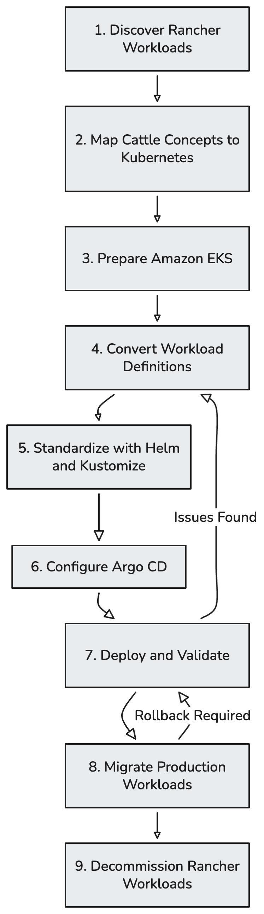

# Migrating Rancher 1.6 Workloads to Amazon EKS

## 1. Overview

Rancher 1.6 Cattle is a legacy, end-of-life container orchestration platform that relies on a proprietary orchestration engine. As organizations transition to modern cloud-native standards, migrating these workloads to a managed Kubernetes service like Amazon EKS becomes essential for long-term supportability and scalability.

The primary objectives of this migration are:
*   **Decommission Legacy Infrastructure:** Remove dependencies on the unsupported Rancher 1.6 Cattle engine.
*   **Native Kubernetes Adoption:** Translate Cattle-specific constructs into standardized Kubernetes resources.
*   **Standardized Packaging:** Implement Helm for reusable application packaging and Kustomize for environment-specific configuration.
*   **GitOps Implementation:** Replace manual UI-driven deployments with a declarative, version-controlled workflow using Argo CD.
*   **Operational Consistency:** Ensure repeatable deployments and minimize configuration drift across environments.

## 2. Source and Target Platforms

### Rancher 1.6 Cattle
Rancher 1.6 environments typically consist of on-premises Docker hosts registered as Rancher agents. Workloads are organized into "Stacks" and "Services," defined by `docker-compose.yml` and `rancher-compose.yml`. Key characteristics include:
*   **Orchestration:** Proprietary Cattle engine (not Kubernetes).
*   **Networking:** Managed overlay networks with built-in HAProxy load balancers.
*   **Metadata:** Extensive use of `io.rancher.*` labels for scheduling and health checks.
*   **Operations:** Manual or partially automated deployments often performed via the Rancher UI.

### Amazon EKS
Amazon EKS provides a managed Kubernetes control plane, allowing organizations to focus on workloads rather than infrastructure management. The target platform components include:
*   **Managed Control Plane:** Highly available Kubernetes API.
*   **Workload Isolation:** Kubernetes namespaces for logical separation.
*   **Image Registry:** Amazon ECR for secure container image storage.
*   **Connectivity:** AWS Load Balancer Controller for Ingress and LoadBalancer services.
*   **Deployment Tools:** Helm for templating, Kustomize for patching, and Argo CD for GitOps reconciliation.

## 3. Concept Mapping

| Rancher 1.6 concept | Kubernetes or AWS equivalent | Notes |
| :--- | :--- | :--- |
| Environment | EKS cluster or environment boundary | Not always a direct mapping. |
| Stack | Namespace, Helm release or Argo CD App | Depends on application organization. |
| Service | Deployment, StatefulSet, DaemonSet or Job | Depends on workload type. |
| Scale | Deployment replicas or HPA | Requires resource configuration. |
| Rancher load balancer | Ingress with ALB or NLB | Depends on traffic type. |
| Health check | Readiness, liveness and startup probes | Probe behavior must be reviewed. |
| Sidekick | Multi-container Pod or separate workload | Depends on lifecycle. |
| Service links | Kubernetes Service discovery and DNS | Legacy link assumptions must be removed. |
| Scheduling labels | Node selectors, affinity, taints/tolerations | Placement rules must be translated. |
| Host volume | PersistentVolumeClaim or redesigned storage | Host paths should normally be avoided. |
| Environment variables | ConfigMap or Secret | Secrets must not be stored in Git. |
| `depends_on` | Probes, retries or init containers | K8s does not guarantee startup order. |
| Catalog template | Helm chart | Used for reusable application packaging. |

## 4. Workload Discovery

Before conversion, each Rancher stack must be audited to identify dependencies and configuration requirements.

### Main Discovery Items
*   **Container Images:** Identify source registries and required tags.
*   **Ports:** Map internal container ports and external service ports.
*   **Configuration:** Inventory environment variables and mount points.
*   **Secrets:** Identify sensitive data (API keys, DB credentials) for migration to a secret manager.
*   **Storage:** Document host-path dependencies or network-attached storage.
*   **Dependencies:** Identify links to other services, external databases, or third-party APIs.

### Workload Inventory Template
| Application | Source Stack | Image | Ports | Storage | Dependencies | Status |
| :--- | :--- | :--- | :--- | :--- | :--- | :--- |
| `<app-name>` | `<stack-name>` | `<image>:<tag>` | `8080` | `PVC` | `Redis, DB` | `Pending` |

## 5. Converting Rancher Services to Kubernetes

The conversion process involves translating Docker Compose and Rancher Compose definitions into Kubernetes manifests.

### Conversion Steps
1.  **Analyze Compose Files:** Review `docker-compose.yml` and `rancher-compose.yml`.
2.  **Remove Rancher Labels:** Strip all `io.rancher.*` labels and Cattle-specific metadata.
3.  **Define Controllers:** Select the appropriate Kubernetes controller (e.g., Deployment for stateless apps, StatefulSet for databases).
4.  **Create Services:** Define `Service` objects for internal discovery and `Ingress` for external access.
5.  **Translate Probes:** Convert Cattle health checks into `livenessProbe` and `readinessProbe` definitions.
6.  **Externalize Config:** Move environment variables into `ConfigMaps` and sensitive data into an external secret-management solution.
7.  **Implement Storage:** Replace host-mounted directories with `PersistentVolumeClaims` backed by cloud storage (EBS/EFS).

### Conversion Example

**Rancher Service (Compose):**
```yaml
# docker-compose.yml
web:
  image: <application-image>:v1
  environment:
    LOG_LEVEL: info
  labels:
    io.rancher.container.pull_image: always

# rancher-compose.yml
web:
  scale: 2
  health_check:
    port: 8080
    request_line: GET /health HTTP/1.0
    interval: 2000
```

**Equivalent Kubernetes Deployment:**
```yaml
apiVersion: apps/v1
kind: Deployment
metadata:
  name: web
spec:
  replicas: 2
  template:
    spec:
      containers:
      - name: web
        image: <aws-account-id>.dkr.ecr.<region>.amazonaws.com/<application-name>:v1
        ports:
        - containerPort: 8080
        readinessProbe:
          httpGet:
            path: /health
            port: 8080
        envFrom:
        - configMapRef:
            name: web-config
```

### Common Migration Issues
*   **`depends_on`:** Kubernetes does not enforce startup order; applications must be resilient to transient dependency failures.
*   **Host Networking:** Avoid using `hostNetwork: true` unless strictly necessary for infrastructure components.
*   **Mutable Tags:** Replace `latest` tags with immutable versions or image digests.
*   **Resource Limits:** Legacy services often lack CPU/Memory limits, which are required for stable Kubernetes scheduling.

## 6. Standardization with Helm and Kustomize

Standardizing deployment patterns ensures that workloads follow platform-wide best practices.

### Helm
Helm is used for reusable application packaging. It provides a templating engine to manage complex Kubernetes manifests with a single set of values.
*   **Templates:** Deployment, Service, Ingress, and HPA.
*   **Standards:** Consistent labels, resource requests/limits, and health probes.

```text
charts/
└── application/
    ├── Chart.yaml
    ├── values.yaml
    └── templates/
        ├── deployment.yaml
        ├── service.yaml
        └── ingress.yaml
```

### Kustomize
Kustomize manages environment-specific configuration and shared Kubernetes resources through an overlay-based approach.
*   **Base:** Common resources shared across all environments.
*   **Overlays:** Patches for specific environments (e.g., increasing replicas in production or changing resource quotas).

```text
platform/
├── base/
└── overlays/
    ├── dev/
    ├── staging/
    └── production/
```

**Division of Responsibility:**
*   **Helm** packages individual applications.
*   **Kustomize** manages the final cluster composition and environment-specific patches.
*   **Argo CD** deploys and reconciles the desired state from Git.

## 7. GitOps with Argo CD

Argo CD replaces manual deployment operations with a GitOps workflow, where Git serves as the single source of truth for the cluster state.

### Deployment Workflow
```text
Configuration change (Git)
    -> Pull request
    -> Review and merge
    -> Argo CD detects the change
    -> Argo CD compares desired and live state
    -> Argo CD synchronizes Amazon EKS
    -> Kubernetes performs the rollout
```

### Key Features
*   **Declarative State:** All resources are defined in Git; manual `kubectl` changes are discouraged.
*   **Drift Detection:** Argo CD identifies and alerts when the live cluster state deviates from the Git configuration.
*   **Self-Healing:** Automatically reverts manual cluster changes to match the Git state.
*   **Promotion:** Environment promotion is handled by moving configuration between Kustomize overlays or updating Helm values in Git.
*   **Rollback:** Reverting a deployment is as simple as reverting a Git commit.

## 8. Migration Phases

The migration follows a structured lifecycle to minimize risk and ensure validation at each stage.



| Phase | Main Activity | Expected Result |
| :--- | :--- | :--- |
| **Discovery** | Inventory existing workloads | Known dependencies and migration scope |
| **Mapping** | Translate Rancher concepts | Defined Kubernetes target resources |
| **Platform Preparation** | Prepare EKS and supporting services | Ready target environment |
| **Conversion** | Create Kubernetes definitions | Workloads represented as native resources |
| **Standardization** | Apply Helm and Kustomize conventions | Consistent deployment configuration |
| **GitOps Onboarding** | Configure Argo CD | Git-controlled deployments |
| **Validation** | Test workloads on EKS | Verified application behavior |
| **Migration** | Move production workloads | Traffic served from EKS |
| **Cleanup** | Remove legacy workloads | Rancher dependency removed |

## 9. Validation

Validation ensures that the migrated workload is correct and performs as expected on the target platform.

*   **Manifest Validation:** Run `helm lint` and `kubectl kustomize` to verify syntax and rendering.
*   **Dry Run:** Use `kubectl apply --dry-run=server` to validate resources against the Kubernetes API schema.
*   **Startup Verification:** Confirm that pods enter a `Running` state without `CrashLoopBackOff`.
*   **Probe Validation:** Verify that `readiness` and `liveness` probes succeed.
*   **Connectivity:** Test internal service-to-service communication and external Ingress access.
*   **Secrets & Config:** Confirm that environment variables and secrets are correctly injected into the container.
*   **Storage:** Verify that persistent volumes are successfully mounted with appropriate permissions.

## 10. Rollback

A rollback strategy must be established before production cutover to handle unforeseen failures.

*   **Git Revert:** Revert the Git commit that triggered the failing deployment to initiate an Argo CD sync to the previous state.
*   **Traffic Reversion:** If using DNS-based cutover, revert DNS records to point back to the legacy Rancher load balancer.
*   **Image Rollback:** Update the Helm values or Kustomize patch to point to the previous known-good container image version.

> [!WARNING]
> Rolling back application traffic does not automatically roll back database schema changes or data modifications. Ensure data consistency is maintained during rollback procedures.

## 11. Completion Criteria

The migration is considered complete when the following criteria are met:
- [ ] Workload is successfully serving traffic from Amazon EKS.
- [ ] All Rancher 1.6 proprietary configurations have been removed.
- [ ] Manifests are version-controlled in Git and deployed via Argo CD.
- [ ] Deployment follows platform standards (Helm/Kustomize).
- [ ] Secrets are managed externally and not stored in Git.
- [ ] Monitoring, logging, and health probes are active and verified.
- [ ] Rollback procedures have been reviewed and tested where possible.
- [ ] Legacy Rancher workloads are decommissioned after a stabilization period.
