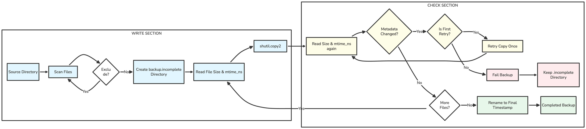

# Backup Utility

Creates a timestamped copy of a directory while preserving file metadata.
`.git` and `__pycache__` directories are always skipped; additional file
extensions can be excluded. Empty directories are preserved, while symbolic
links are skipped so a backup cannot copy data from outside the source tree.

Preview a backup first:

```bash
python3 backup.py ~/Documents ~/Backups --dry-run
```

Run it and exclude temporary and log files:

```bash
python3 backup.py ~/Documents ~/Backups --exclude .tmp --exclude .log
```

The script refuses to place the destination inside the source because that can
cause backups to copy themselves recursively.

Each file's size and nanosecond modification time are checked before and after
copying. A file that changes is copied once more; if it changes again, the
backup fails and keeps its `.incomplete` suffix. This catches most concurrent
writes, but it is not a consistent snapshot of the whole directory. Pause the
writer or use filesystem snapshots or an application's native backup command
when cross-file consistency is required.

## How it works



Topics demonstrated: `pathlib`, recursive traversal, argument parsing,
timestamps, safety validation, best-effort change detection, and `shutil.copy2`.
